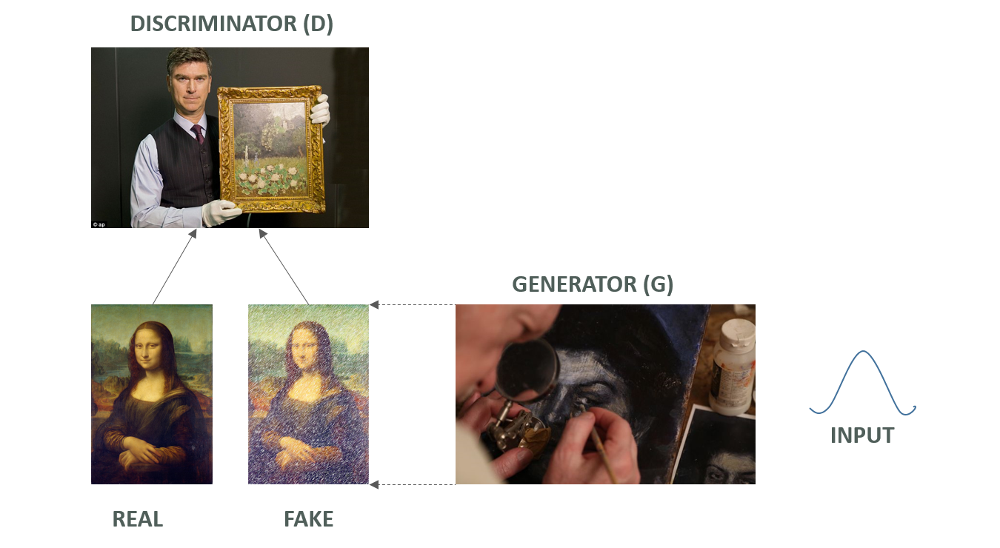

I find **Generative Adversarial Nets framework (GANs)**, [proposed](https://arxiv.org/pdf/1406.2661.pdf) by Ian Goodfellow and his colleagues at University of Montreal, very fascinating. This novel technique relies on **pitching two different deep neural nets against each other** to achieve state-of-the-art results in estimating generative models:

 - **Generator (G)** which takes a random input and tries to generate an output (fake data) close to the real data (and consequently fool the other DNN)
 - **Discriminator (D)** which takes as input real data and generated data (fake data) and tries to distinguish one from the other

*Both these DNNs try to outdo each other and thus keep improving themselves in their function.*

Since a picture is a lot better than a thousand words, here's a diagram that explains it really well:

In this repository, I'll be sharing some of my quick experiments with various GANs.

I'll use the [Pytorch Library](http://pytorch.org/) in this project. Although I like [Tensorflow](https://www.tensorflow.org/), I'm increasingly getting more inclined towards pytorch because it's quite similar to python libraries like [Numpy](http://www.numpy.org/) and debugging is a lot easier than Tensorflow.

Here are the links to my quick experiments with GANs so far:

 - [ **GANs** to generate handwritten digits](https://nbviewer.jupyter.org/github/sangeetkar/GANs/blob/master/mnist_GAN.ipynb)
 - [ **DCGANs** to generate novel faces](https://nbviewer.jupyter.org/github/sangeetkar/GANs/blob/master/DCGAN_faces.ipynb)

